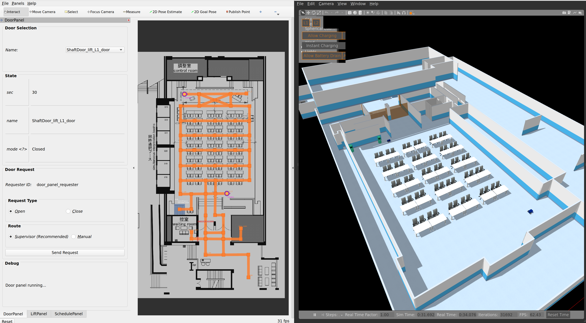

# roscon_workshop
Materials for Open-RMF workshop at ROSCon 2022 Kyoto



Launch the demo world
```bash
ros2 launch roscon_gz_classic workshop.launch.xml
```

Send a robot to the balcony
```bash
ros2 run rmf_demos_tasks dispatch_patrol -p balcony_1 --use_sim_time
```

Send a patrol request
```bash
ros2 run rmf_demos_tasks dispatch_patrol -p p3 p5 p8 --use_sim_time
```

## roscon_maps

## roscon_fleet_adapter

## roscon_door_adapter

## roscon_lift_adapter
