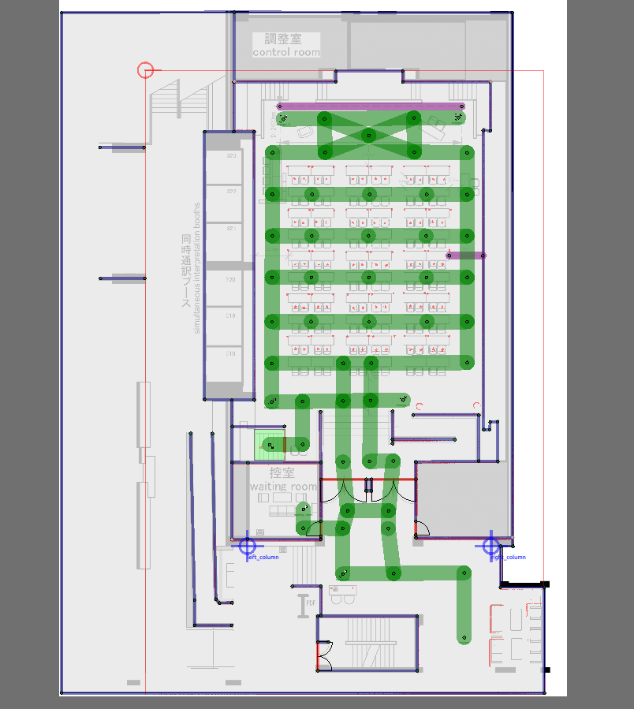

# roscon_workshop
Materials for Open-RMF workshop at ROSCon 2022 Kyoto


## Overview
The goal of this workshop is to guide participants through the process of
setting up an Open-RMF deployment at a facility. This includes:
* Importing and annotating a floor plan with artifacts to generate a digital twin of the world and navigation graphs that will be used by the fleets.
* Implementing a `full control` fleet adapter to integrate a fleet of robots with Open-RMF.
* Implementing a door adapter to integrate a set of doors with Open-RMF.
* Implementing a lift adapter to integrate a set of lifts with Open-RMF.
* Configuring and running the `rmf-web` dashboard for managing operations.
* Trying our various scenarios.

**At the beginning of the workshop, please ensure you have checked out to `workshop` branch.
The `main` branch contains the codebase with the final implementations of all the steps above and may be used as reference along the way.**

Live instructions will be provided at each step with accompanying slides.
The sections below contain relevant launch instructions for each milestone.

## Floor plan annotation
After annotation your floor plan in `rmf_traffic_editor` might look like this.
It is perfectly okay if it looks different. Creativity is welcome!


Build the workspace.
```bash
cd ~/roscon_ws
source ~/rmf_ws/install/setup.bash
colcon build
```

Launch the auto-generated digital twin in `gazebo-classic`
```bash
cd ~/roscon_ws
source install/setup.bash
ros2 launch roscon_gz_classic world.launch.xml run_adapters:=false
```

To launch the example world
```
ros2 launch roscon_gz_classic world.launch.xml run_adapters:= false map_name:=workshop_example
```

## Fleet integration with Open-RMF

Launch the demo world
```bash
ros2 launch roscon_gz_classic workshop.launch.xml
```

Send a robot to the balcony
```bash
ros2 run rmf_demos_tasks dispatch_patrol -p balcony_1 --use_sim_time
```

Send a patrol request
```bash
ros2 run rmf_demos_tasks dispatch_patrol -p p3 p5 p8 --use_sim_time
```

## roscon_maps

## roscon_fleet_adapter

## roscon_door_adapter

## roscon_lift_adapter
