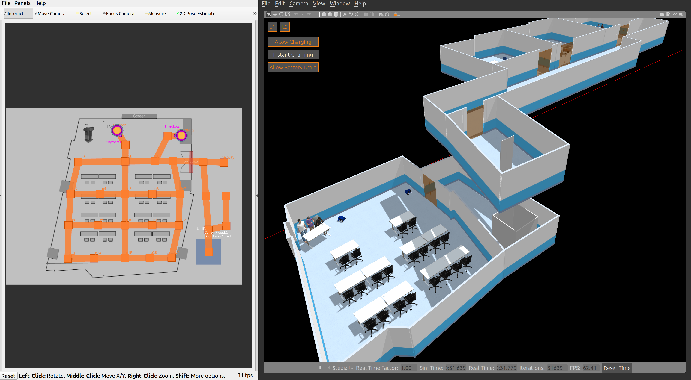
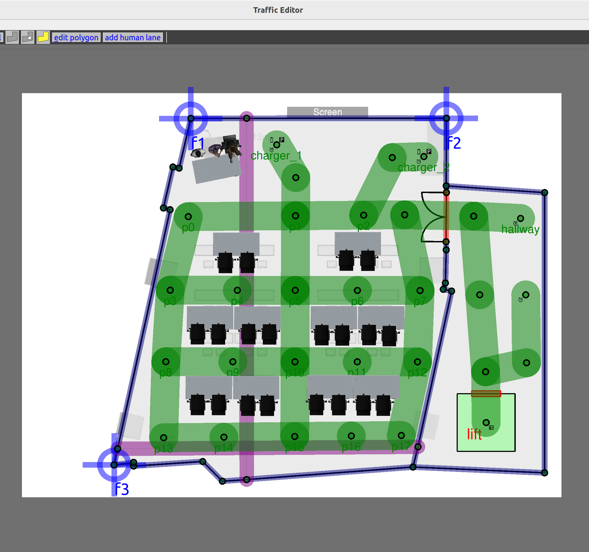
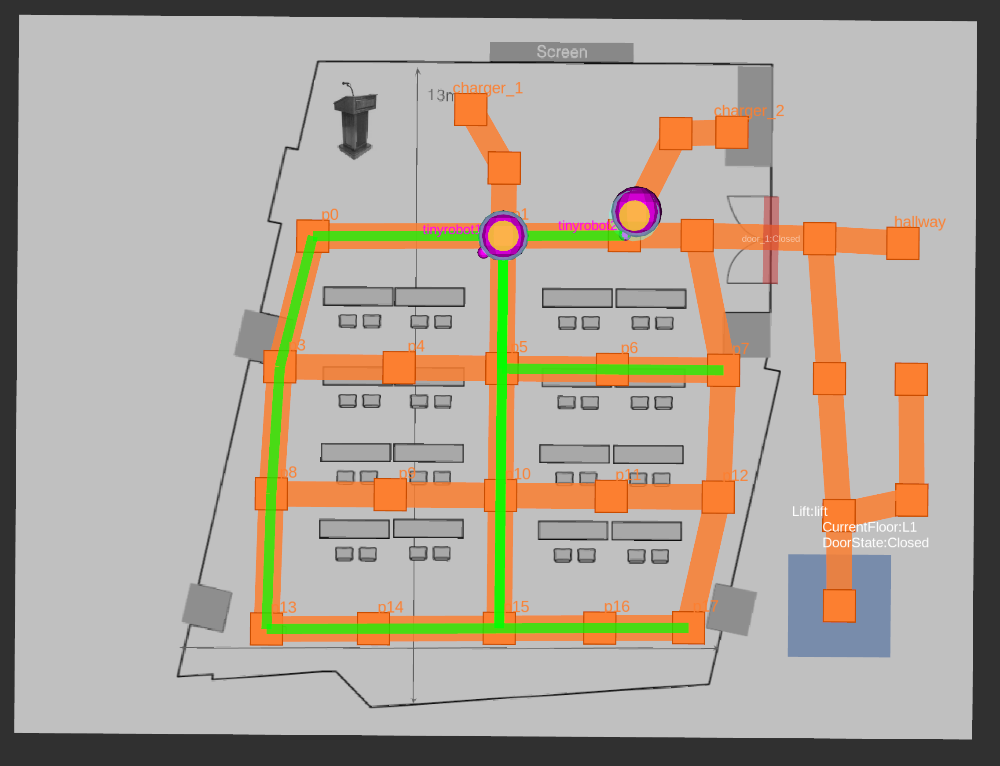
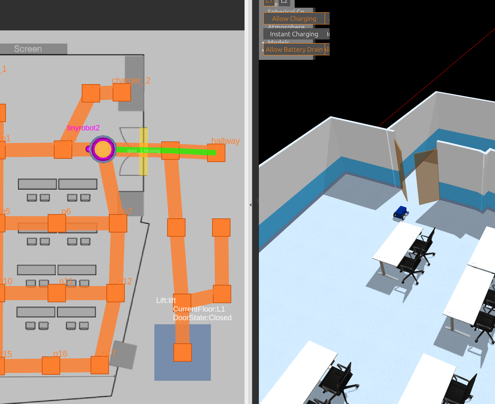
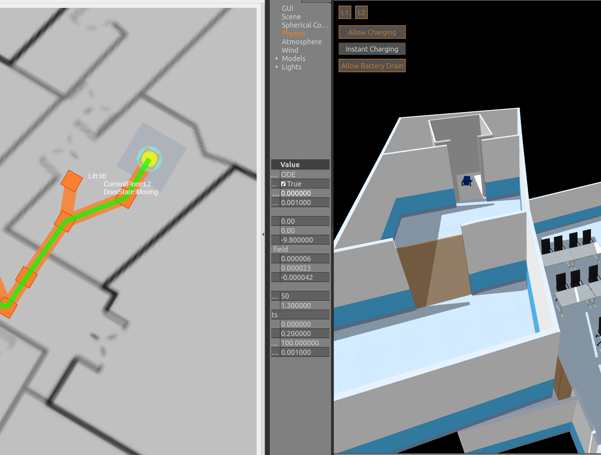
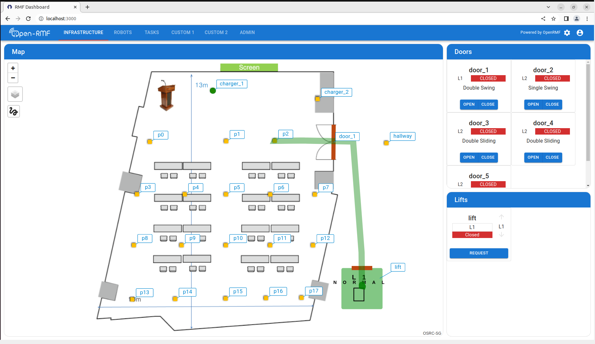

# Open-RMF workshop: Conference
Materials for Open-RMF workshop.



## Overview
The goal of this workshop is to guide participants through the process of
setting up an Open-RMF deployment at a facility. This includes:
* Importing and annotating a floor plan with artifacts to generate a digital twin of the world and navigation graphs that will be used by the fleets.
* Implementing a `full control` fleet adapter to integrate a fleet of robots with Open-RMF.
* Implementing a door adapter to integrate a set of doors with Open-RMF.
* Implementing a lift adapter to integrate a set of lifts with Open-RMF.
* Configuring and running the `rmf-web` dashboard for managing operations.
* Trying our various scenarios.

**At the beginning of the workshop, please ensure you have checked out to `workshop` branch.
The `main` branch contains the codebase with the final implementations of all the steps above and may be used as reference along the way.**

Live instructions will be provided at each step with accompanying slides.
The sections below contain relevant launch instructions for each milestone.

## Floor plan annotation
After annotation your floor plan in `rmf_traffic_editor` might look like this.
It is perfectly okay if it looks different. Creativity is welcome!


Build the workspace.
```bash
cd ~/roscon_ws
source ~/rmf_ws/install/setup.bash
colcon build
```

Launch the auto-generated digital twin in `gazebo-classic`
```bash
cd ~/roscon_ws
source install/setup.bash
ros2 launch roscon_gz_classic workshop.launch.xml run_adapters:=false map_name:=conference
```

## Fleet integration with Open-RMF


Launch the demo world. You should now be able to see the schedule and fleet
state markers in RViz for each robot.
```bash
cd ~/roscon_ws
source install/setup.bash
ros2 launch roscon_gz_classic workshop.launch.xml map_name:=conference
```
Then send a couple of patrolling tasks to Open-RMF.
```bash
cd ~/roscon_ws
source install/setup.bash
ros2 run rmf_demos_tasks dispatch_patrol -p p0 p5 p15 p17 -n 3 --use_sim_time
ros2 run rmf_demos_tasks dispatch_patrol -p p13 p15 p1 p7 -n 3 --use_sim_time
```
> Note: You may see some errors from the lift and door adapters but this okay,
we will implement them shortly.

## Door integration with Open-RMF


Launch the demo world. You should now be able to see the door states in RViz.
You can also use the `DoorPanel` to manually open/close doors to test the
adapter.
```bash
cd ~/roscon_ws
source install/setup.bash
ros2 launch roscon_gz_classic workshop.launch.xml map_name:=conference
```

Request a robot to go outside. Open-RMF will automatically request the integrated
door to open and close as the robot passes through.
```bash
cd ~/roscon_ws
source install/setup.bash
ros2 run rmf_demos_tasks dispatch_patrol -p hallway --use_sim_time
```

## Lift integration with Open-RMF


Launch the demo world. You should now be able to see the lift states in RViz.
You can also use the `Lift` to manually command the lift.
```bash
cd ~/roscon_ws
source install/setup.bash
ros2 launch roscon_gz_classic workshop.launch.xml map_name:=conference
```

Request a robot to go to `L2`. Open-RMF will automatically request the integrated
lift to transport the robot to the second level. Remember to change
`Map Name` in the `SchedulePanel` to `L2` to visualize the second level when
the robot transitions.
```bash
cd ~/roscon_ws
source install/setup.bash
ros2 run rmf_demos_tasks dispatch_patrol -p room_2 --use_sim_time
```

## Launching with rmf-web dashboard


Launch the demo world with the additional `server_uri` launch argument. This allows the fleet adapter to communicate with the `api-server`.

```bash
cd ~/roscon_ws
source install/setup.bash
ros2 launch roscon_gz_classic workshop.launch.xml map_name:=conference server_uri:="ws://localhost:8000/_internal"
```

The simulation will warn that the client is not connected. Next, we launch the `api-server`, which will make that warning go away, and an acknowledgement that it has been connected.

```bash
source ~/roscon_ws/install/setup.bash
cd ~/rmf-web/packages/api-server
pnpm run start
```

In another terminal serve the built static dashboard, and proceed to [http://localhost:3000](http://localhost:3000).

```bash
source ~/roscon_ws/install/setup.bash
cd ~/rmf-web/packages/dashboard
serve -s build
```
